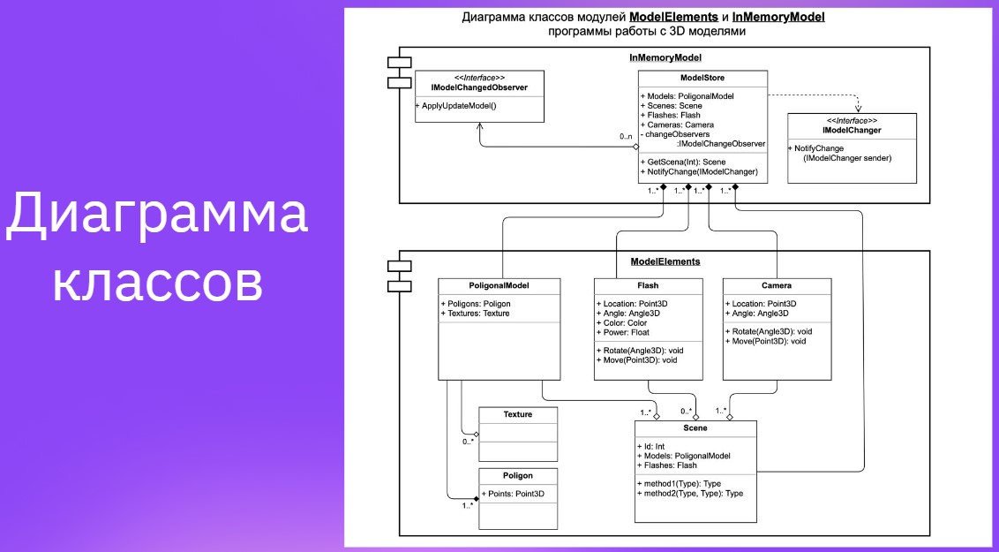

***HomeWork 1. Введение в понятие архитектуры, проектирование ПО и жизненный цикл программного продукта. UML-диаграммы***

Задание 1. На основе Диаграмы классов ModelElements, разработать классы: Model Store, PoligonalModel (Texture, Poligon), Flash, Camera, Scene (Реализовать диограмму на любом языке программирования)

Задание 2. Ознакомиться с документацией в свободном формате, которая может пригодиться Вам для дальнейшей работы:

__
ГОСТ Р ИСО/МЭК 12207-2010 Информационная технология (ИТ). Системная и программная инженерия. Процессы жизненного цикла программных средств.
ISO/IEC/IEEE 29148:2018 Systems and software engineering — Life cycle processes — Requirements engineering
Стандарты ЕСКД — единая система конструкторской документации
ГОСТ 2.001-2013 ЕСКД. Общие положения
Стандарты АСУ ГОСТ 34 — автоматизированные системы управления
Стандарты ЕСПД ГОСТ 19 — единая система программной документации
__
https://www.cybermedian.com/ru/a-comprehensive-guide-to-uml-class-diagram/
__
В этой призентации, в конце есть диограмма для 'Задания 1'
https://docs.google.com/presentation/d/1d-ReTu3A_944hmccTxqbUrRNMHtIDViiCMKvUUaKu24/edit?pli=1#slide=id.g161fe117232_1_7
__

Задание 3. (На выбор 1 или 3 задание )
Создать UML Диограмму Классов..
__
Задание: Разработка системы для онлайн-магазина книг.
Описание:
Вы разрабатываете диаграмму классов для онлайн-магазина книг. Система позволяет пользователям просматривать каталог книг, оформлять заказы и получать информацию о заказанных книгах.
__
Требования:
Создайте классы для представления книг, пользователей и заказов.

Класс "Книга" должен содержать атрибуты, такие как название, автор, жанр и цена.

Примеры атрибутов:

title: String (название книги)
author: String (автор книги)
genre: String (жанр книги)
price: double (цена книги)
__
Класс "Пользователь" должен содержать атрибуты, такие как имя, адрес электронной почты и список заказанных книг.
__
Примеры атрибутов:

name: String (имя пользователя)
email: String (адрес электронной почты пользователя)
orderedBooks: List<Book> (список заказанных книг)
__
Класс "Заказ" должен содержать атрибуты, такие как идентификатор заказа, дата оформления заказа и список книг, включенных в заказ.
__
Примеры атрибутов:

orderId: int (идентификатор заказа)
orderDate: Date (дата оформления заказа)
orderedBooks: List<Book> (список книг в заказе)
__
Предоставьте методы в соответствующих классах для получения и установки значений атрибутов.
__
Примеры методов:

public String getTitle(): возвращает название книги.
public void setTitle(String title): устанавливает название книги.
public List<Book> getOrderedBooks(): возвращает список заказанных книг пользователя.
public void addBookToOrder(Book book): добавляет книгу в список заказанных книг.
__
Добавьте методы в класс "Пользователь" для добавления книг в список заказов и получения общей стоимости заказа.
__
Примеры методов:

public double getTotalOrderCost(): возвращает общую стоимость заказа пользователя.
__
Добавьте метод в класс "Заказ" для получения информации о заказанных книгах и общей стоимости заказа.
__
Примеры методов:

public List<Book> getOrderedBooks(): возвращает список книг в заказе.
public double getTotalOrderCost(): возвращает общую стоимость заказа.
__
Предоставьте ассоциации между классами "Книга" и "Пользователь", а также между классами "Пользователь" и "Заказ".
__
Примеры ассоциаций:

"Пользователь" ассоциирован с "Книгой" через атрибут "orderedBooks" (отношение "1..").
"Пользователь" ассоциирован с "Заказом" через атрибут "orderedBooks" (отношение "1..").
__
Добавьте несколько методов в класс "Книга" и "Пользователь", чтобы сделать систему более интересной.
__
Примеры дополнительных методов:

public void addToFavorites(Book book): добавляет книгу в избранное пользователя.
public List<Order> getOrderHistory(): возвращает историю заказов пользователя.
__
Помните о правильных связях между классами, таких как агрегация или ассоциация.
__
Ниже помощь для 3-го задания
__
Декомпозиция задачи на разработку диаграммы классов для онлайн-магазина книг:
Определение основных классов и их атрибутов:
__
Класс "Книга" с атрибутами: название, автор, жанр, цена.
Класс "Пользователь" с атрибутами: имя, адрес электронной почты, список заказанных книг.
Класс "Заказ" с атрибутами: идентификатор заказа, дата оформления заказа, список книг в заказе.__
Определение связей между классами:
__
Класс "Пользователь" ассоциирован с классом "Книга" через атрибут "orderedBooks" (отношение "1..").
Класс "Пользователь" ассоциирован с классом "Заказ" через атрибут "orderedBooks" (отношение "1..").
Добавление методов в класс "Книга":__
__
getTitle(): возвращает название книги.
setTitle(String title): устанавливает название книги.
getAuthor(): возвращает автора книги.
setAuthor(String author): устанавливает автора книги.
getGenre(): возвращает жанр книги.
setGenre(String genre): устанавливает жанр книги.
getPrice(): возвращает цену книги.
setPrice(double price): устанавливает цену книги.
Добавление методов в класс "Пользователь":__
__
getName(): возвращает имя пользователя.
setName(String name): устанавливает имя пользователя.
getEmail(): возвращает адрес электронной почты пользователя.
setEmail(String email): устанавливает адрес электронной почты пользователя.
getOrderedBooks(): возвращает список заказанных книг пользователя.
addBookToOrder(Book book): добавляет книгу в список заказанных книг.
Добавление методов в класс "Заказ":__
__
getOrderId(): возвращает идентификатор заказа.
setOrderId(int orderId): устанавливает идентификатор заказа.
getOrderDate(): возвращает дату оформления заказа.
setOrderDate(Date orderDate): устанавливает дату оформления заказа.
getOrderedBooks(): возвращает список книг в заказе.
addBookToOrder(Book book): добавляет книгу в список книг в заказе.
Добавление дополнительных методов (опционально):__
__
addToFavorites(Book book): добавляет книгу в избранное пользователя.
getTotalOrderCost(): возвращает общую стоимость заказа пользователя.
getOrderHistory(): возвращает историю заказов пользователя.

